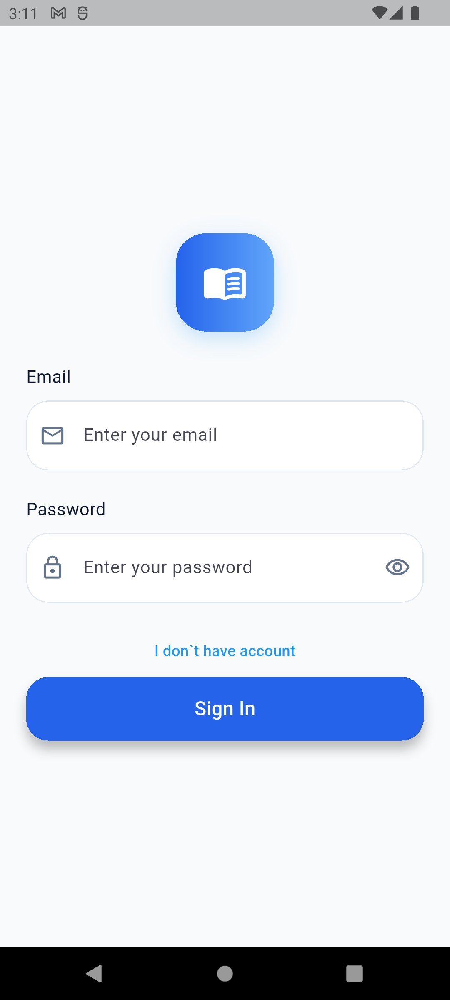
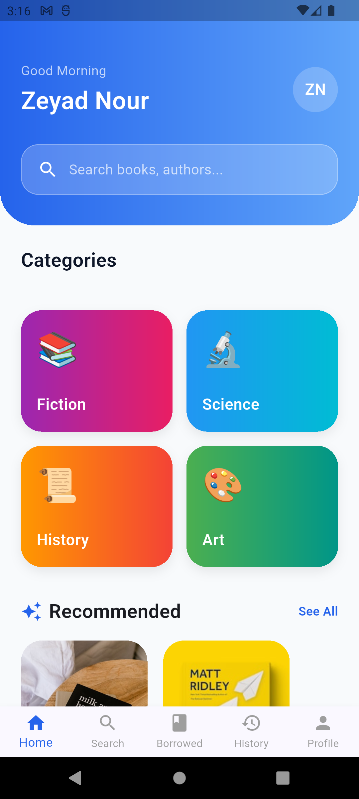
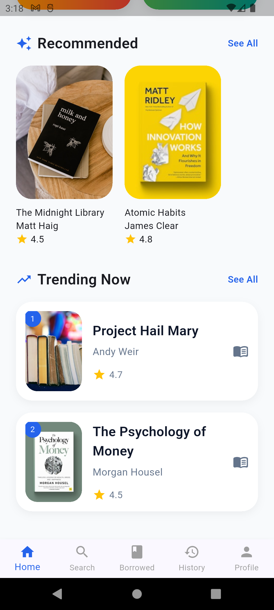
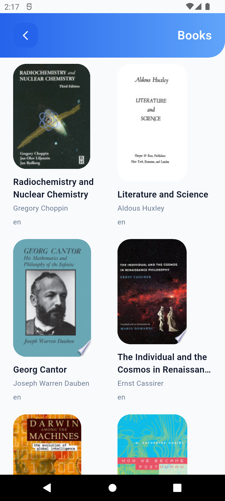
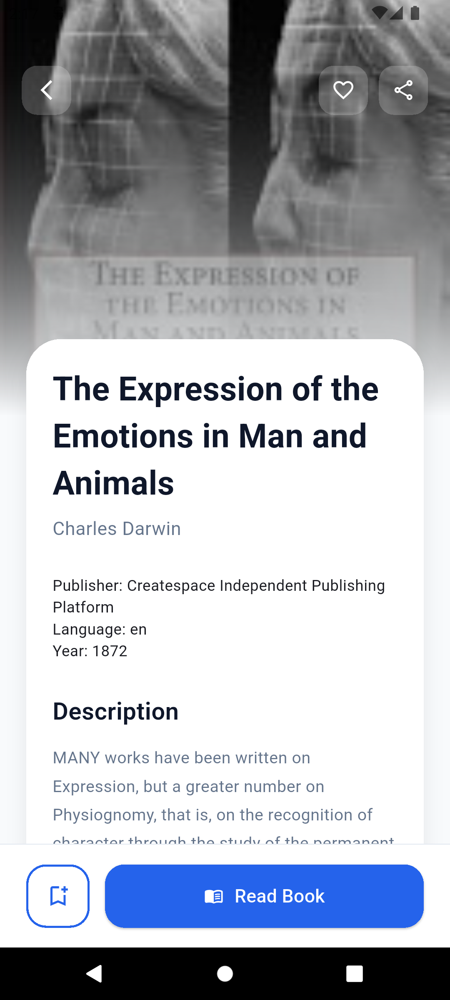
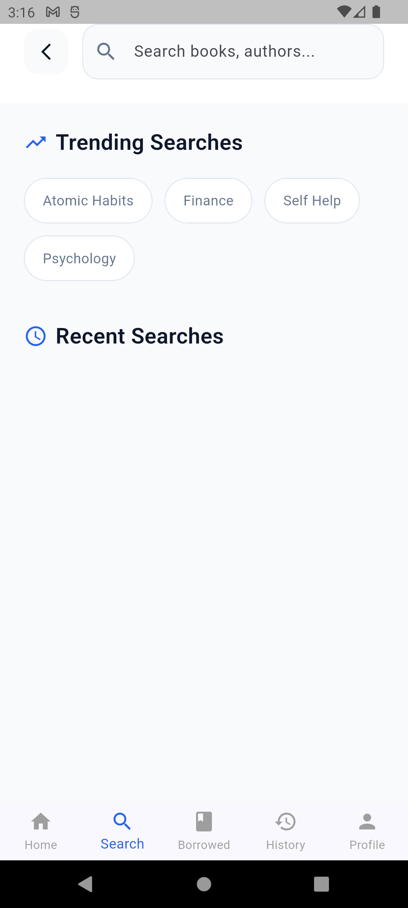
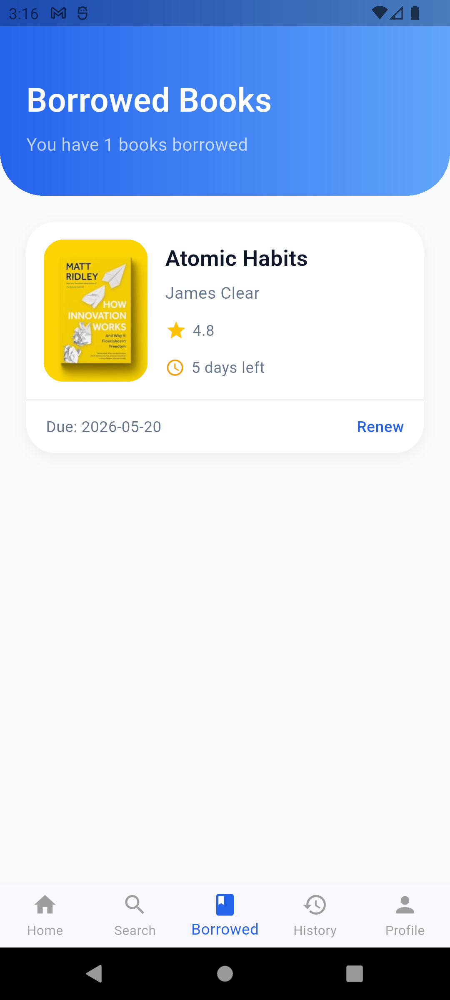
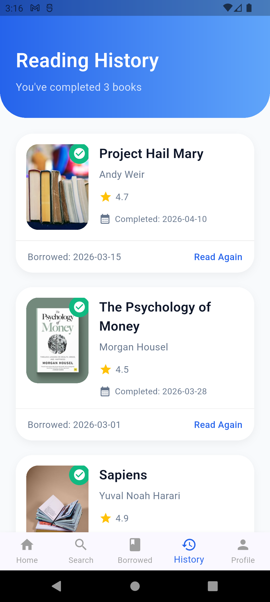
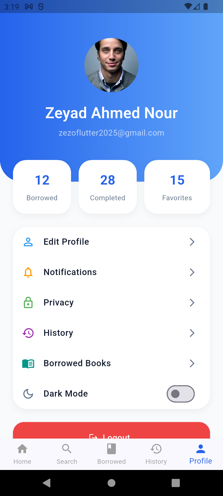

# 📚 Readora - Digital Library App

A modern Flutter-based digital library application built as a **university graduation project**.  
The app provides a smooth experience for browsing, searching, and managing books using Firebase Authentication and Google Books API.

---

## 🚀 Features

- 🔐 Firebase Authentication (Sign Up / Login / Logout)
- 📧 Email verification system
- 🔍 Advanced book search functionality
- 📚 Browse books from Google Books API
- 🏠 Home dashboard with categories & recommendations
- 📖 Borrowed books tracking
- 🕒 Reading history system
- 👤 Profile & settings management
- 🌙 Dark / Light mode support
- ⚡ Clean architecture (MVVM + Repository Pattern)
- 🧠 State management using Cubit (BLoC)
- ❌ Centralized error handling system
- 📱 Responsive UI design

---

## 🛠️ Tech Stack

- Flutter (Dart)
- Firebase Authentication
- Firebase Core
- Dio (HTTP Client)
- Cubit (BLoC State Management)
- MVVM Architecture
- Google Books API

---

## 📱 App Screens

---

### 🔐 Authentication

  

---

### 🏠 Home Screens

  
  

---

###  Book

  

---
###  Details

  

---
### 🔍 Search

  

---

### 📚 Books & Borrowing

  
  

---

### 👤 Profile & Settings

  

---

## 🧠 Architecture

The project follows a clean scalable structure:
